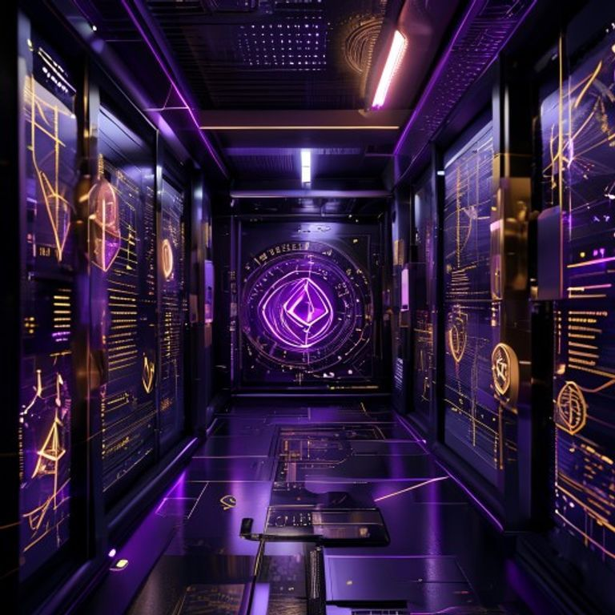
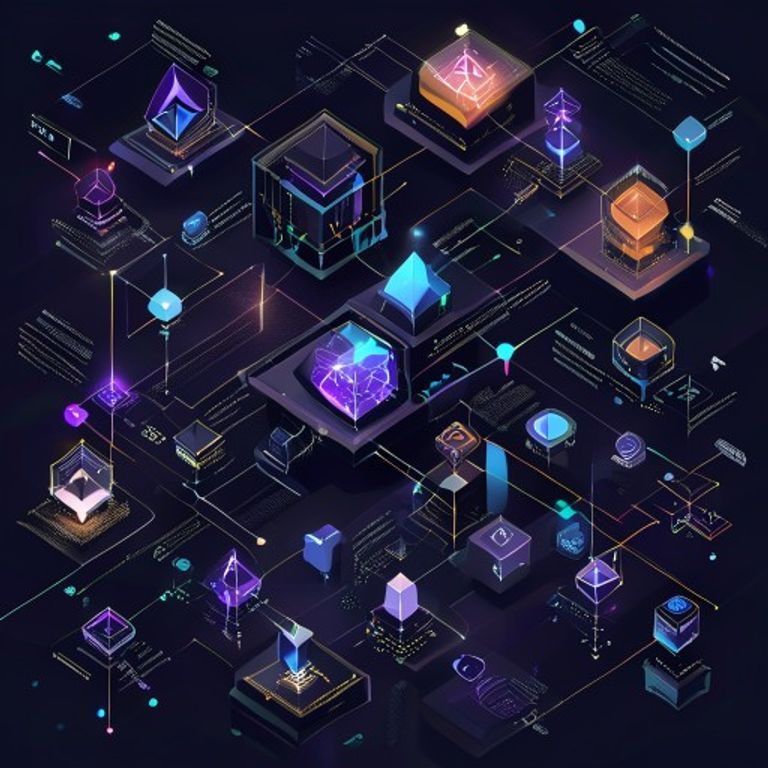
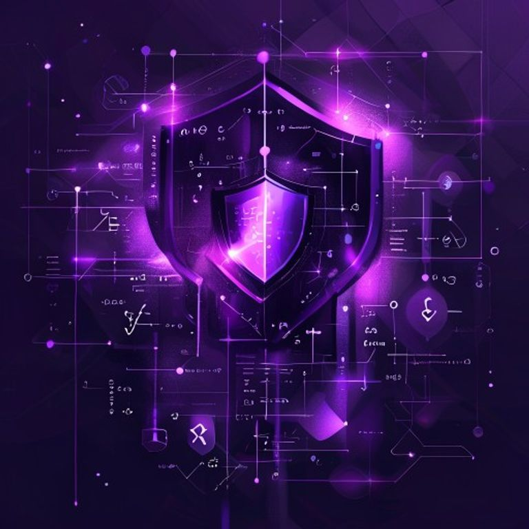
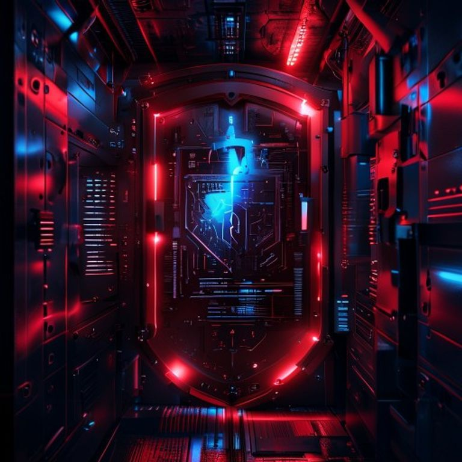

# 🔒 BAKOME-Vault v2.0

<p align="center">
  
</p>

<p align="center">
  <strong>Multi-Chain Non-Custodial Vault Infrastructure</strong>
</p>

<p align="center">
  
  
  
  
</p>

## 🛠️ Modules

| Module | Description |
|--------|-------------|
| 🔐 Vault Engine | Non-custodial vault creation & management |
| 🔮 ZK-Proof Engine | Zero-Knowledge solvency proofs |
| 🔒 FHE Engine | Fully Homomorphic Encryption |
| 🏰 TEE Engine | Trusted Execution Environment |
| 📈 Yield Optimizer | AI-powered (MoE 256) yield optimization |
| 🌉 Bridge Engine | Cross-chain bridges (Wormhole, LayerZero) |
| 🛡️ Security Auditor | Automated vault security scoring |

## 🚀 Quick Start

```bash
cargo run

## 📸 Visual Overview

### Architecture


### Zero-Knowledge Proofs


### AI Yield Optimizer (MoE 256)


### Cross-Chain Bridges


### Security Audit


## 🎥 Demo

[](assets/demo.mp4)

